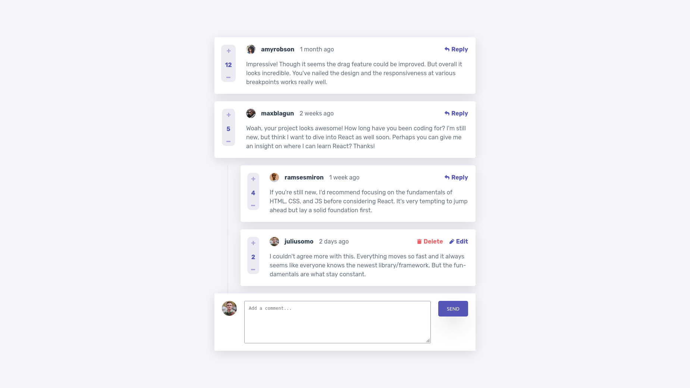
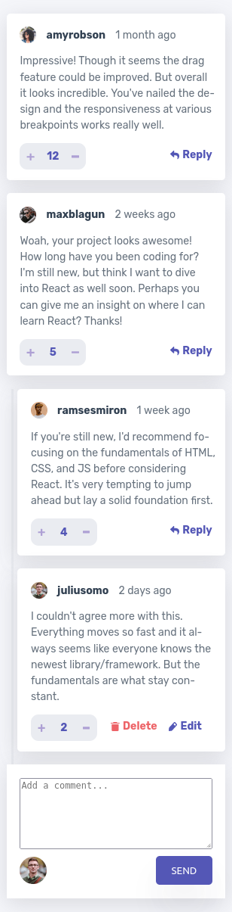

# Frontend Mentor - Interactive comments section solution

This is a solution to the [Interactive comments section challenge on Frontend Mentor](https://www.frontendmentor.io/challenges/interactive-comments-section-iG1RugEG9). Frontend Mentor challenges help you improve your coding skills by building realistic projects.

## Table of contents

- [Overview](#overview)
  - [The challenge](#the-challenge)
  - [Screenshot](#screenshot)
  - [Links](#links)
- [My process](#my-process)
  - [Built with](#built-with)
  - [What I learned](#what-i-learned)
  - [Continued development](#continued-development)
  - [Useful resources](#useful-resources)
- [Author](#author)
- [Acknowledgments](#acknowledgments)

**Note: Delete this note and update the table of contents based on what sections you keep.**

## Overview

### The challenge

Users should be able to:

- View the optimal layout for the app depending on their device's screen size
- See hover states for all interactive elements on the page
- Create, Read, Update, and Delete comments and replies
- Upvote and downvote comments
- **Bonus**: If you're building a purely front-end project, use `localStorage` to save the current state in the browser that persists when the browser is refreshed.
- **Bonus**: Instead of using the `createdAt` strings from the `data.json` file, try using timestamps and dynamically track the time since the comment or reply was posted.

### Screenshot




### Links

- Solution URL: [Add solution URL here](https://your-solution-url.com)
- Live Site URL: [Live Site](https://interactive-comments-section-five-sigma.vercel.app/)

## My process

### Built with

- Semantic HTML5 markup
- CSS custom properties
- Flexbox
- CSS Grid
- Desktop-first workflow
- [React](https://reactjs.org/) - JS library
- [SCSS](https://sass-lang.com/) - For styles

### What I learned

1. I used CSS Grid to build most of the layouts. It is really helpful espacially in the responsive design part. In the design I tried placing the reply button and vote container next to each other and without CSS grid, it felt impossible.
2. Used moment.js to add the current date relative to our current time. like below:
3. I set the data flow from child-to-parent using setter functions. I learned a lot from this project.
4. Use position:fixed; and absolute if you want to place a modal and make it all page wide.

```jsx
import moment from "moment";

createdAt: moment().toString(),
  //received the value at the Post component and get the relative time.

  moment(data.createdAt).toNow();
```

### Continued development

I definitely need to refactor my code. In its current state, it looks like a mess. Needs more components and a better file structure, style part of things can be changed too. Finally I didn't used localStorage to keep the state.

### Useful resources

- [Learn CSS Grid](https://learncssgrid.com/) - A great site, if you want to check how do you use the grid properties.

## Author

- Frontend Mentor - [@yumelih](https://www.frontendmentor.io/profile/yumelih)
